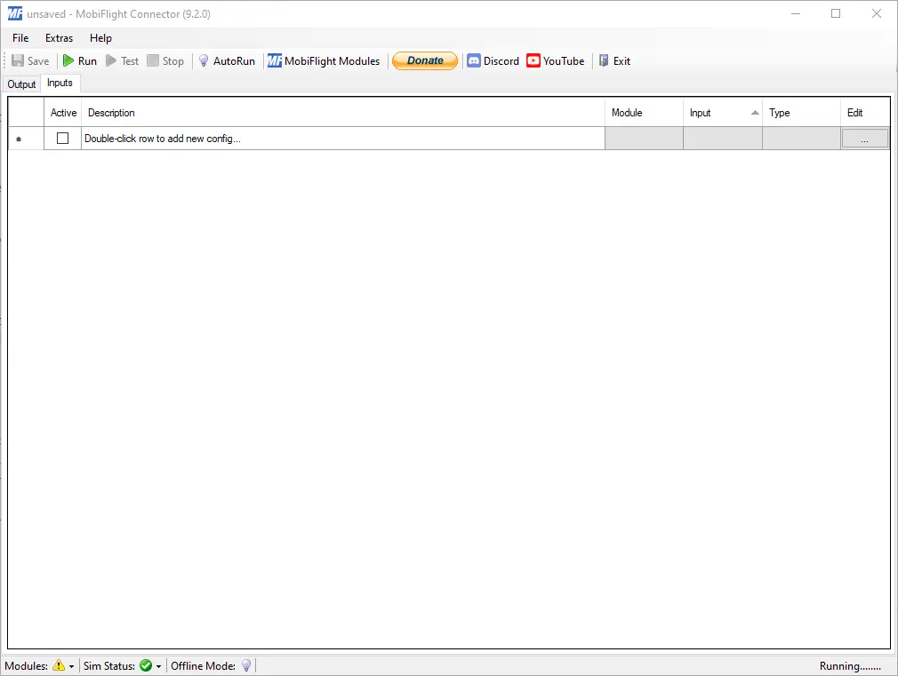
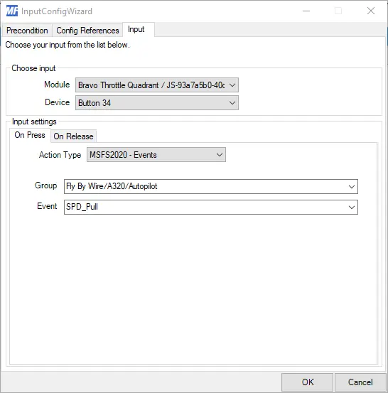
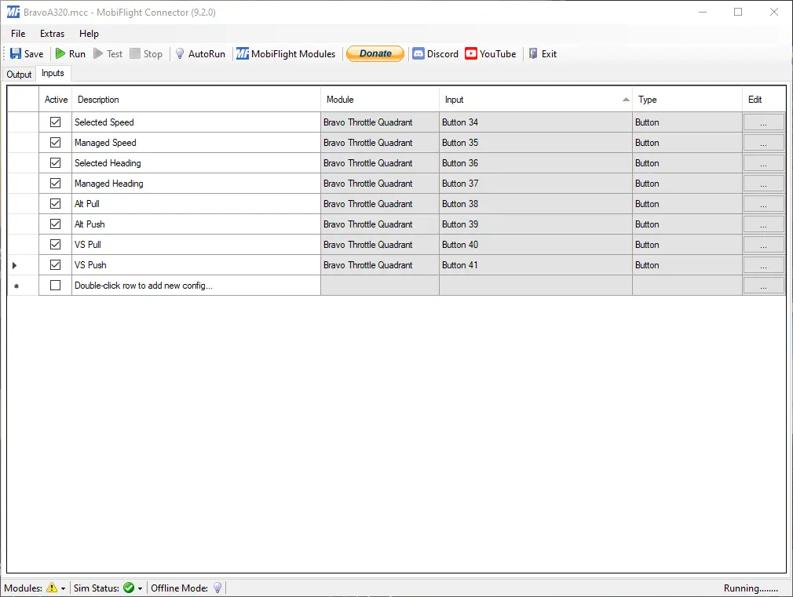

+++
authors = ["JPGame"]
title = "How To Assign Honeycomb Bravo Buttons FBW A320 In MSFS2020"
date = "2023-12-11"
description = "How to use Mobiflight to assign Honeycomb Bravo Throttle buttons to control the FlyByWire A320 in MSFS2020."
feature = "A320_cockpit.webp"
tags = []
categories = []
#series = ""

+++

## Introduction
The Bravo Throttle from Honeycomb is an amazing tool for MSFS2020, but I always felt a little frustrated with the lack of button customization options in the sim, especially when it came to the A320.

GA flying with the bravo has been great, most of the button options can be assigned directly within the sim. However, I also enjoy flying airliners and I want to use the unassigned buttons on the Bravo Throttle to remove the need for mouse clicks when making common changes during a flight. Mainly, Selected / Managed Heading mode, Vertical Speed mode, and Selected / Managed Speed mode.

Previously, there hasn’t been an option for us to make this happen, and then Mobiflight released version 9.1 which allowed me to configure the bravo directly.

## Enter MobiFlight
If you don’t already know, Mobiflight is a piece of software that sits between the sim and your cockpit hardware and provides a lot of integration options. Initially I have been using it to connect home-made hardware built with 3d printers and Arduino boards, but with the version 9.1 they provide support for any joystick which is attached to the machine and shows up in windows. I will show you how I set my Bravo Throttle to control the A320.

## Install MobiFlight
Go to mobiflight.com and download the latest version. MobiFlight + Arduino + Your Favorite Flight Simulator = Your Home Cockpit!
Unzip it to a location of your choice.

## Configure the Honeycomb Bravo Throttle Buttons

Open the Mobiflight Connector folder and double click MFConnector.exe, click Yes to any popups appear the first time you open it.
It should look like this image:

Double-click on the part that says ‘Double-Click’ and type in ‘Selected Speed’
Now click on the edit button at the right of the window.
InputConfigWizard window should appear. Make sure the ‘Input’ tab is the active tab.
In the ‘Module’ dropdown, choose your Bravo Throttle Quadrant and in the ‘Device’ dropdown, choose the button you want to configure.
I start with 34 because it is the leftmost switch, and I am trying to keep it in line with the FCU panel on the A320.

For ‘Input Settings’ we choose the ‘On Press’ tab and select the ‘Action type’ of ‘MSFS2020 – Events’
In ‘Group’ scroll through to find the ‘Fly By Wire/A320/Autopilot’ and select it.
For ‘Event’ we want to select the event that will trigger when we press the button, which will be ‘SPD Pull’.
Press ‘OK’ to save the configuration. It should be the same as the image here:

With the first button configured, it’s a case of repeating the steps above for the others. As I mentioned previously, I start at the left of the Bravo Throttle and move right to mirror the FCU which has the Speed knob, then the Heading knob, followed by the Alt knob, and finally the Vertical Speed knob but, feel free to use any button combination you like.

Repeat the steps above until you have added all the button configs from the table below.

| Mobiflight Configuration |  |  |  |
|---|---|---|---|
| Description | Device | Group | Event |
| Selected Speed | Button 34 | Fly By Wire/A320/Autopilot | SPD_Pull |
| Managed Speed | Button 35 | Fly By Wire/A320/Autopilot | SPD_Push |
| Selected Heading | Button 36 | Fly By Wire/A320/Autopilot | HDG_Pull |
| Managed Heading | Button 37 | Fly By Wire/A320/Autopilot | HDG_Push |
| Alt Pull | Button 38 | Fly By Wire/A320-Dev/Autopilot | A32NX_FCU_ALT_PULL |
| Alt Push | Button 39 | Fly By Wire/A320-Dev/Autopilot | A32NX_FCU_ALT_PUSH |
| VS Pull | Button 40 | Fly By Wire/A320-DEV/Autopilot | A32NX_FCU_VS_PULL |
| VS Push | Button 41 | Fly By Wire/A320-DEV/Autopilot | A32NX_FCU_VS_PUSH |

By now, your connector should look like this:

Make sure to ‘Tick the box’ to make the line active, otherwise it won’t work. Now click ‘Run’ and start your sim.
The Bravo buttons should now be controlling the functions we configured in the previous steps.

## Notes
I recommend testing this out when you have a flight plan configured in the MCDU.
I am using the Dev version of the FBW A320 mod, if you are not using this version then some event triggers may be different but you should find what you need.