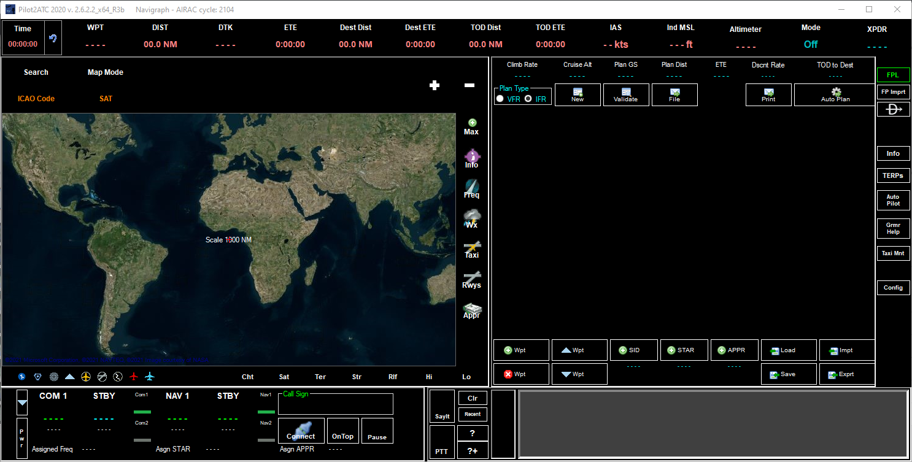
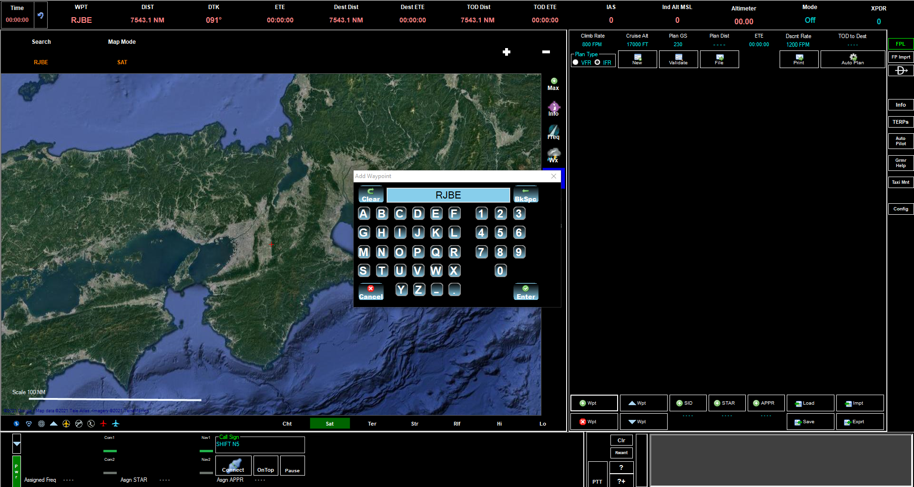
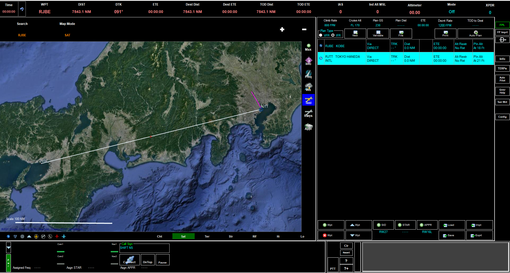
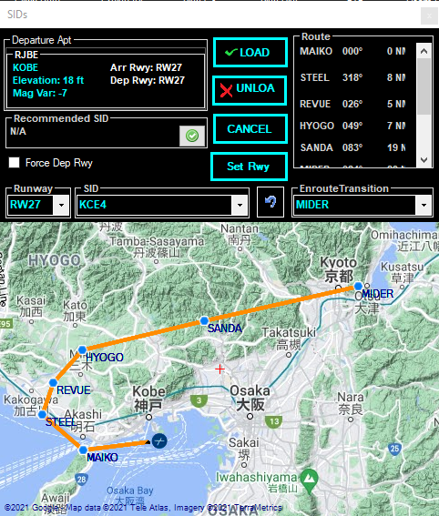
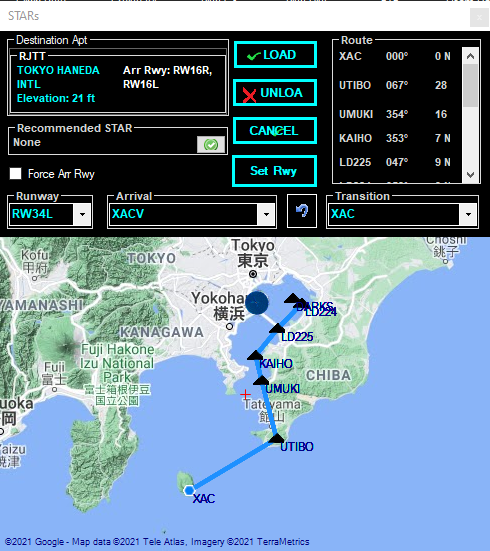
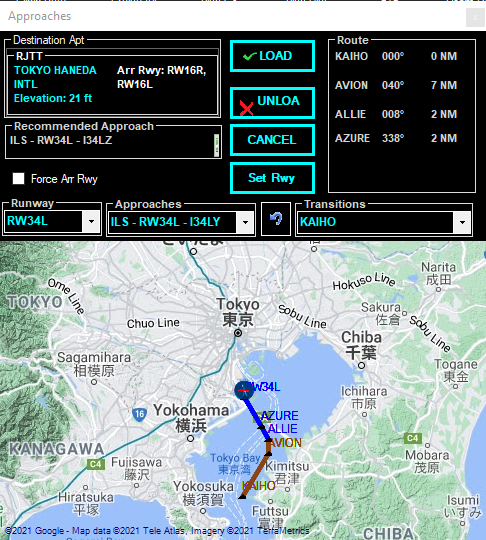

Pliot2ATC is a companion program that connects to MSFS2020 (and other sims) providing a more realistic and immersive Air Traffic Control (ATC). The in-game ATC is universally known to be awful and I came across Pilot2ATC while looking for alternatives. It is available as a 10 day trial from https://pilot2atc.com/. The author encourages using the trial period to get familiar with the software before you buy the full version, which will set you back $59.95 US.

Back to the reason for this article and that is making the flight plan with Pilot2ATC and importing it into MSFS2020. 
The software can seem a little daunting at first, the user interface isn't the prettiest but it makes up for it in functionality.  
I assume you have already opened the software and are presented with a screen similar to mine here:

Let's plan a flight from Kobe - **RJBE** to Tokyo Haneda -**RJTT**.

1. Click on the **Add Waypoint** button. (WPT with the green plus sign)

3. Enter our origin airport ICAO code, which is **RJBE**, and click **Enter**.

4. Repeat step 3, adding another waypoint for our destination airport ICAO code, which is **RJTT**, and click **Enter**.

The map should show the basic straight line plan between the two airports and the right hand pane should have your waypoints listed as text.  
We are going to populate it with the correct departures, arrivals, approaches, and, airways.

5. Click on the **SID** button, a pop-out window appears with the available Standard Instrument Departure procedures, since we are flying East, let's select a SID with a transition heading East.  
    I chose **MIDER** by clicking on it within the window.

6. Click **LOAD** to insert the procedure into our flight plan. You should notice the procedure and waypoints appear in the plan window.

8. Next, we can add our standard arrival route, click on the **STAR** button.

10. Choose the runway, arrival, and, transition you would like.  
    I went for RW34L, XACV arrival via XAC Transition.  
    Click **LOAD** to add it to our plan.

9. We now add the approach by clicking the **APPR** button.  
    With the correct runway selected, look through the various approaches until you see one that you would like. I wanted an ILS landing so I looked through the available ILS approaches and chose one which had a transition point that worked with the **STAR** we picked previously.  
    **ILS - RW34L - I34LY** has a transition point at **KAIHO** which matches out **STAR** so I chose it.

11. Once again, click **LOAD** to add it to our plan.

11. The plan is almost complete, we have our Departure and arrival set but we can also add an airway to take us from the end transition point of our departure to the entry transition point of our arrival. To do this, find the **MIDER** waypoint in our plan. On the left of the waypoint there is a triangle icon. Clicking it brings up an options window.

13. Click the **Load Airway** option.

15. We now have the airway options that are available from the **MIDER** waypoint. We are looking for the **XAC** waypoint (which is the entry transition into our **STAR**) so scroll through the options until we find what we need. Its **Airway Y71** **To Wpt XAC**, highlight both options and click **LOAD.**

Our route is now complete, Top of Descent will be automatically calculated and shown on the map as a green arrow. We can change the **Climb Rate, Cruise Alt, Plan GS, and, Dscnt Rate** simply by clicking on them within the plan and entering our data. Changing these should cause the software to recalculate the Top of descent automatically.  
All that is left to do is export our plan and import it into the sim. If you click the **Export** button a window appears with various sim options. Tick the box next to **MSFS2020** and browse to a save location on your machine using the **...** icon. I also tick the **Export SID/STAR/Approach** button.  
Give it a filename and click the export button and it will be ready for the sim.

From the flight plan screen in **MSFS2020** click the load/save option, browse to the Pilot2ATC save location and import the .pln file.

https://vimeo.com/555051232
