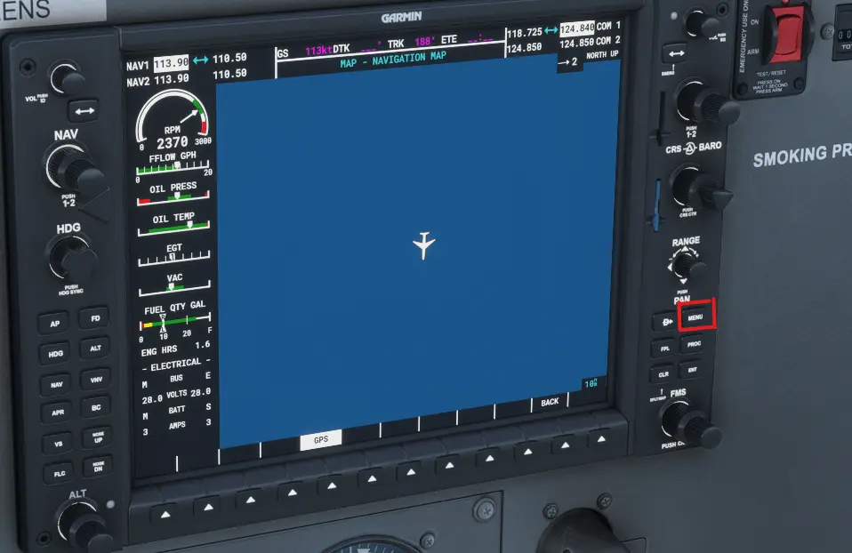
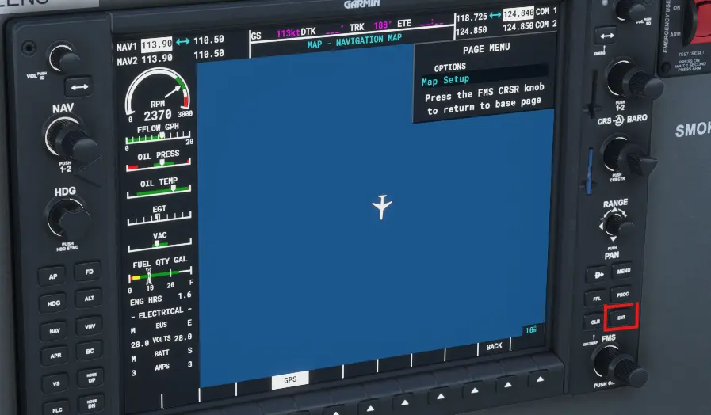
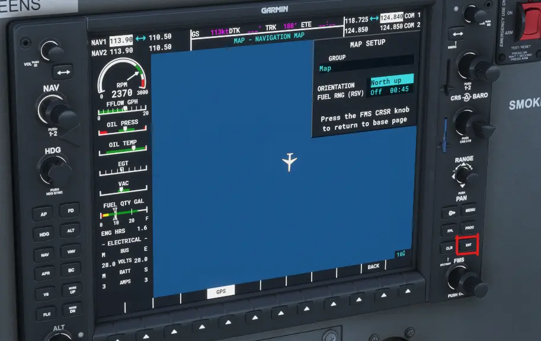
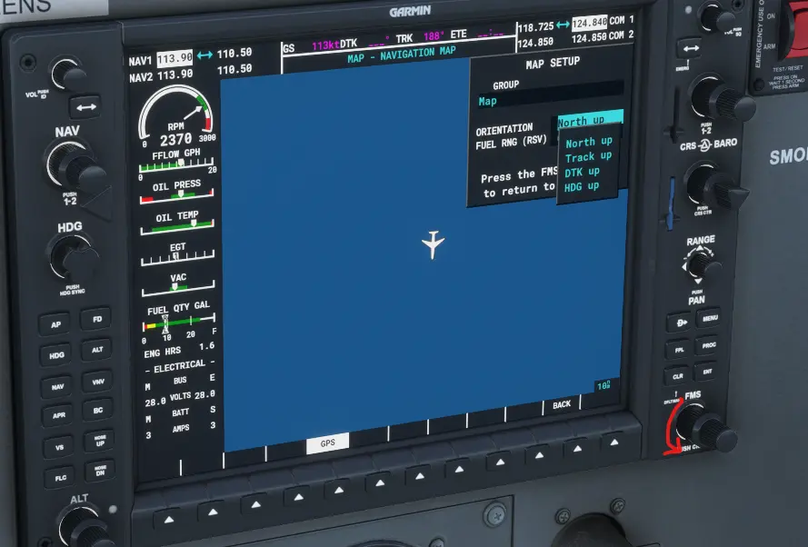
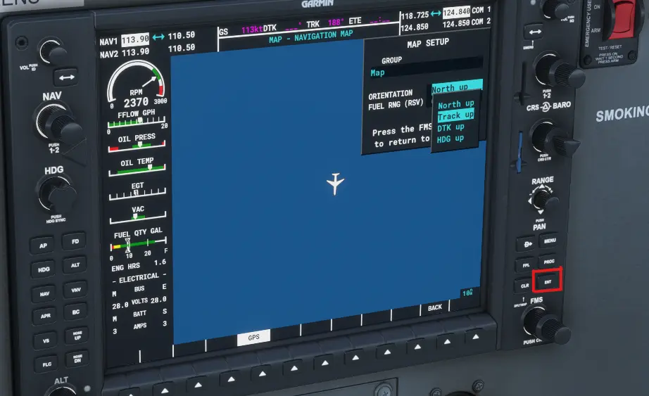
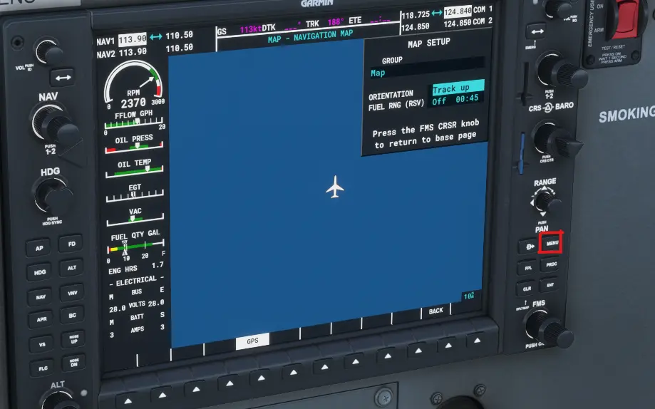

The G1000 map orientation defaults to **North Up**. You can check the current orientation at the top right of the MFD screen.  
The orientation can be changed in the MFD menu.

Follow these steps to change:

1. On the MFD, click the **Menu** button.

2. On the **Map Options** screen, click the **ENT** button.

3. On the **Orientation** screen, click the **ENT** button.

4. Use the **FMS Knob** to select the desired option for example, **Track UP**.

5. Click **ENT** to save your selection.

6. Click **ENT** twice to leave the menu and go back to the MFD map display. Your chosen orientation settings should now be saved.
