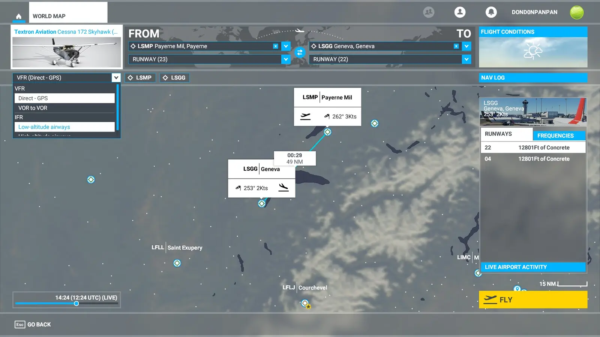
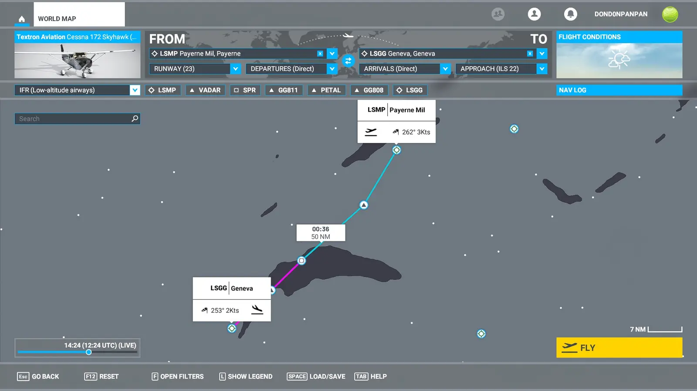
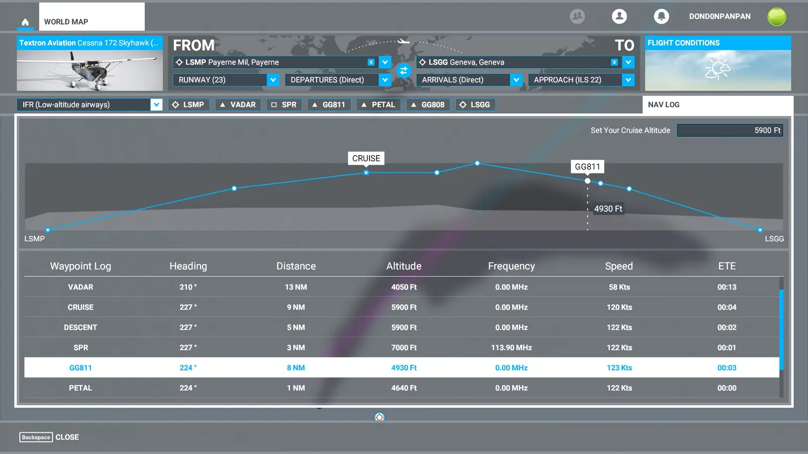
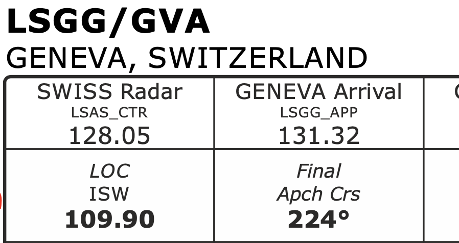
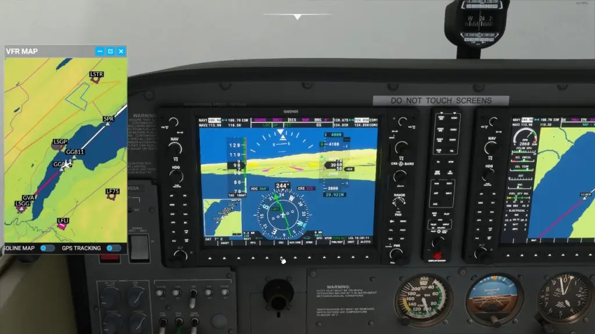

If you have been trying to perform an ILS landing using an aircraft equipped with the Garmin 1000 on Microsoft Flight Sim 2020 then there is a good chance that it hasn't been working. Fortunately, I have a solution. Follow my guide below and you should be happily landing using the ILS system.

## Create The Flight Plan

Step 1 is to create the flight plan in the **World Map**. In the example I used for this guide, I select **LSMP** as the departure and **LSGG** as the arrival. The flight plan will default to **Direct-GPS**, please change this to **Low-altitude airways.**

After changing to low-altitude airways, you will notice an extra field under the **arrival** airport. This **Approach** field is where we can specify the ILS or RNAV approach path we would like to use.

Go ahead and select **Approach (ILS 22)** which will give us a straight approach in to Geneva. With the approach selected we can then click on the **Nav Log** button to have a look at our cruise altitude and **most importantly** our waypoints. Specifically, the altitude of the last waypoint before the runway.

You can see here that the final waypoint before the runway is **GG808** and it's altitude is **4000ft**.

The reason we are so interested in this point is that it is the **Final Fix** for the ILS system to use the automatic approach. What it means is that if we are at the specified altitude (here it is 4000ft) as we cross this point then the ILS system can take over and bring the aircraft in to land.

It is possible to double-check the final fix and other waypoints close to the airport by looking at the approach charts (sometimes called plates). these can be found online at various places. I look at these sites first and if I can't find the information there I will search google:

[https://skyvector.com/](https://skyvector.com/)

[https://chartfox.org/](https://chartfox.org/)

## Reading The Approach Chart

Here is the plate for our landing at LSGG.

We are looking for the localizer frequency which is displayed in the top left of the plate.

**109.90** is the localizer frequency we need to input into our Garmin 1000 when we prepare for take-off. **ISW** will be displayed next to the frequency when we lock onto the signal at approach.

## Input The NAV Frequency

We need to input the localiser frequency that ILS will use when it comes time to start the approach.

Look at the top left of the G1000 display, you will see the NAV1 and NAV2 frequencies, we want to input the frequency for the runway we have chosen into NAV1, in this case, it is 109.90.

To the left of the display is the NAV tuner. You will see two sets of numbers next to NAV1 separated by blue arrows. The numbers on the left have a white box surrounding them, this indicates the frequency we can edit. The large wheel changes the numbers before the decimal point, the smaller wheel will tune the numbers after. Tune the desired frequency then click on the arrows button above the tuning dials. This will move the frequency from the right to the left and store it in the NAV receiver.

## Prepare For Approach

I check the VFR map periodically to see how close I am to the final waypoint and then, descend to the required altitude a few NM before the waypoint, please ignore ATC if they start to tell you that you are at the wrong altitude, just trust the flight plan!

As we get closer, the **NAV1** should tune into the localizer. I set my PFD display to show both NAV1 and GPS so I can see when the signal is located. A glide slope indicator (white G) will also appear to the left of your Altitude Tape once the locator is locked in.

Coming up to the Final Fix point, **Turn approach mode ON** by pressing the **APR** button. Next, change the **CDI** from **GPS** to **LOC1**.

The purple indicator will turn green and so will the glide slope indicator (G). A green diamond should now be visible in the glide slope indicator. This will move up and down as a visual reference to your glide angle.

## Approach

If you have switched everything on from the previous steps and you are at the correct altitude (which is the crucial part), the automatic descent will begin. From this point on, you only need to control the AirSpeed using the throttle.

I try to keep the Cessna G1000 to 85 kts for the descent. It is a good point to add flaps during this stage, it will increase the altitude initially however, the system will adjust to keep you on the correct glide path.

The only thing left to do is get ready to remove the auto pilot and flare up slightly as you land.

